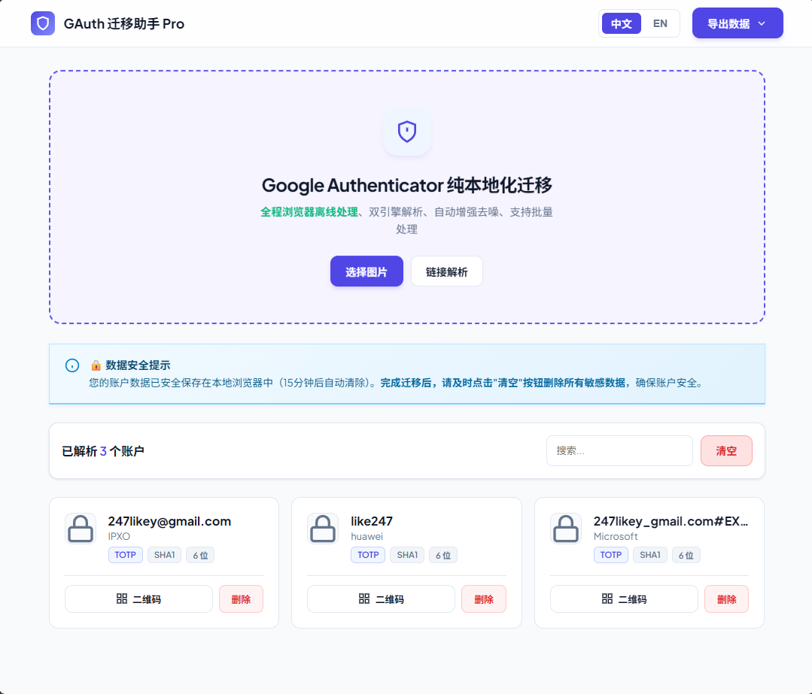

# 🛡️ GAuth Migrator Pro (Google Authenticator 迁移助手)


一个**纯静态、离线运行**的网页工具，用于将 **Google Authenticator (Google 验证器)** 的导出数据（Protobuf 格式二维码）转换为 **Bitwarden**、**1Password**、**KeePass** 等密码管理器支持的通用格式。

> 🔴 **痛点解决**：Google Authenticator 的导出二维码使用私有 Protobuf 协议，且包含多个账户，普通扫码器无法识别。本工具专为解决此问题而生。

---

## ✨ 核心特性

* 🔒 **隐私优先**：代码完全在浏览器端运行，**绝不上传**任何图片或密钥数据到服务器。支持断网使用。
* 🚀 **双引擎暴力解析**：
    * 集成 **ZXing** 和 **jsQR** 双重识别引擎，互为兜底。
    * 内置**图像增强算法**（自动二值化、反色、锐化、放大），专治微信/截图导致的图片模糊、噪点问题。
* 📂 **批量处理**：支持一次性拖拽上传多张二维码截图，自动合并与排重。
* 🛠️ **智能修复**：
    * 自动修正 Google 协议中的位数定义问题（1 -> 6位, 2 -> 8位）。
    * 自动匹配常见服务（GitHub、AWS、Google 等）的图标和网址。
* 📤 **多格式导出**：
    * **Bitwarden JSON**：完美支持 Vaultwarden/Bitwarden 导入。
    * **通用 CSV**：支持 1Password, KeePassXC, Enpass, LastPass 等。
    * **纯文本 URI**：标准 `otpauth://` 链接，支持 Aegis 或再次生成二维码。

## 🖼️ 界面预览

*(建议在此处放一张工具运行时的截图，文件命名为 screenshot.png 并放在仓库根目录)*


## 📖 使用指南

### 第一步：从 Google Authenticator 导出
1.  打开 Google Authenticator App。
2.  点击右上角菜单 -> **转移账号** -> **导出账号**。
3.  选择要导出的账号，屏幕会显示**二维码**。
4.  **截图**保存这些二维码（如果有多个二维码，请依次截图）。

### 第二步：解析与迁移
1.  打开本工具网页（或本地运行 `index.html`）。
2.  点击 **“选择图片”** 或直接将截图拖入上传区。
    * *如果图片识别失败，可尝试使用手机系统相机/微信扫描二维码，复制获得的 `otpauth-migration://...` 长链接，点击工具右上角的“链接解析”。*
3.  工具会自动解析并显示账户列表。
4.  点击右上角的 **“导出数据”**，选择你需要的格式（推荐 **Bitwarden JSON**）。

### 第三步：导入密码管理器
* **Bitwarden/Vaultwarden**：登录网页版 -> 工具 -> 导入数据 -> 选择 **Bitwarden (json)**。
* **其他软件**：一般选择 CSV 导入或扫描生成的 URI。

## 🛠️ 技术栈

* **核心逻辑**: Vanilla JavaScript (ES6+)
* **UI 框架**: HTML5 + CSS3 (Flexbox/Grid、Glassmorphism 风格)
* **二维码识别**:
    * [`zxing-js/library`](https://github.com/zxing-js/library) (主引擎)
    * [`cozmo/jsQR`](https://github.com/cozmo/jsQR) (兜底引擎)
* **协议解析**: 手写 Protobuf 解码器 (无需庞大的 proto 库依赖)

## 🌐 在线使用

如果不介意，可直接用我部署的版本（纯静态托管）：
👉 **[https://g-auth.beiai.de](https://g-auth.beiai.de)**

## 📦 本地部署 (推荐)

为了最大程度保证安全，建议将代码下载到本地运行：

1. 克隆本仓库：
   ```bash
   git clone [https://github.com/247like/google-auth-migrator.git](https://github.com/247like/google-auth-migrator.git)
2. 直接用浏览器打开 `index.html` 即可使用。
3. *(可选)* 如果需要纯净环境，可断开网络连接后操作。

## ⚠️ 免责声明

本工具旨在帮助用户迁移个人数据。

1.  **安全警告**：导出的 JSON/CSV 文件包含您所有的 2FA 密钥（TOTP Secret），**请务必妥善保管，导入完成后立即彻底删除导出文件**。
2.  作者不对因使用本工具导致的数据丢失或泄露承担任何责任。

## 📄 开源协议

本项目采用 [MIT License](LICENSE) 开源。

---

<div align="center">
    如果您觉得这个工具好用，请给一颗 ⭐ 星！
</div>
